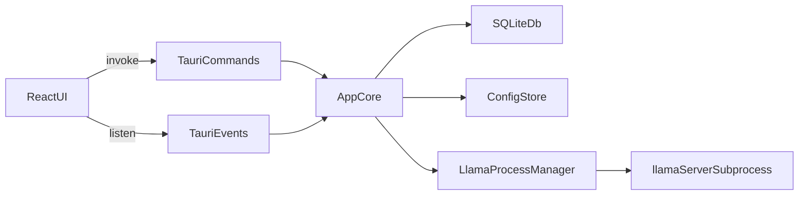

# Native Tauri Desktop Migration Plan

## Progress checklist (maintenance)

Use this section to tick what is done in the repo (update as you land PRs). Sections further down still describe the migration intent; where they contradict the checklist, treat the checklist as the source of truth for what landed.

- [x] **Architecture doc** — `docs/DESKTOP_ARCHITECTURE.md` describes desktop-first vs optional HTTP backend.
- [x] **`app_core`** — `src-backend/src/app_core/` with domain modules; Axum routes are thin wrappers calling `app_core`.
- [x] **HTTP standalone** — `AppRuntime` uses `LLAMASTUDIO_APP_PORT` (default 6868); `app_port` removed from `AppConfig` / config store / integration tests.
- [x] **DB `desktop_ui_state`** — schema v3 + `get_ui_preferences` / `set_ui_preferences` / `merge_browser_ui_migration` commands.
- [x] **Tauri shell** — `src-frontend/src-tauri/src/lib.rs`: no `AppRuntime` / no `tauri-plugin-localhost`; `WebviewUrl::App("index.html")`; `AppState` managed; server + download background emitters.
- [x] **Tauri commands** — `src-frontend/src-tauri/src/commands.rs`: IPC parity with former REST surface; chat streaming via `create_chat_stream_data_strings` (Axum `Event` has no public data getter).
- [x] **Frontend transport** — `src/lib/platform/*`, `api.ts` using `invoke` + `listen` on Tauri; replace `useWebSocket` / `streamChat` fetch path; add `@tauri-apps/api`.
- [x] **Settings / types** — Remove any remaining `app_port` from `api.ts` / `SettingsPage.tsx` if still present; align `AppConfig` type with backend.
- [x] **UI prefs wiring** — On desktop boot: `bootstrapDesktopUiFromLegacy` (optional `mergeBrowserUiMigration` from `llamastudio-app` + `llama-studio-custom-templates`), `getUiPreferences` hydrate, noop Zustand persist on desktop, `DesktopUiPrefsSync` + `setUiPreferences` for templates.
- [x] **Installers** — `tauri.windows.conf.json`: NSIS MUI (`sidebar`/`header` BMPs, `licenseFile`, `installMode` both, languages, `installerHooks`), WiX stable `upgradeCode`; `tauri.linux.conf.json` / `tauri.macos.conf.json`; `install-linux.sh` (deb/rpm/AppImage); `packaging/winget/` manifests (refresh hashes/URLs per release); `scripts/gen-nsis-bmps.py`; `NO_STRIP` + `cross-env` in `pnpm tauri build` for linuxdeploy; release + CI wiring (`--no-sign` mac until signing).
- [x] **CI / release automation** — PR `tauri build` smoke on Linux (`deb`), Windows (`nsis`), macOS (`dmg`, `TAURI_BUNDLER_DMG_IGNORE_CI`); release uploads per-platform `shasums-<platform>.txt`, `llamastudio-tauri-bundle-<platform>.tgz` (full `bundle/` tree), backend `*.sha256`, `tauri-action` `uploadPlainBinary`; optional `.github/workflows/winget-hash-refresh.yml` (`workflow_dispatch`) to print SHA256 for `packaging/winget/` updates.
  - **PR / smoke (`--no-sign`):** no Apple/Windows PFX secrets required; macOS DMG smoke sets `TAURI_BUNDLER_DMG_IGNORE_CI=true`.
  - **Production signing (drop `--no-sign` when secrets present):** `WINDOWS_CERTIFICATE` (base64 PFX) + `WINDOWS_CERTIFICATE_PASSWORD`; `APPLE_CERTIFICATE` (base64) + `APPLE_CERTIFICATE_PASSWORD` (+ usual Apple notarization env as configured for `tauri build`, e.g. API key / asc provider); release job passes `--no-sign` only when the matching secret is unset.
  - **Tauri updater / artifacts:** `TAURI_SIGNING_PRIVATE_KEY`, `TAURI_SIGNING_PRIVATE_KEY_PASSWORD`, `TAURI_UPDATER_PUBKEY` (mapped to `LLAMASTUDIO_UPDATER_PUBKEY` for bundling).

## Goal
Deliver a real desktop application, not a browser-style localhost shell. The finished product must:

- open bundled app assets directly inside Tauri instead of navigating the webview to `http://localhost:*`
- remove the desktop app’s dependency on the Axum/TCP listener path for internal UI communication
- preserve current local-first behavior, SQLite persistence, and `llama-server` subprocess management
- install cleanly and feel native on Linux, Windows, and macOS
- provide a premium guided Windows installer instead of the current minimal bundle defaults

## What Exists Today
The current desktop app is technically Tauri, but its runtime behavior is still server-oriented.

Key evidence in the current repo:

- The desktop shell opens an external localhost URL in [src-frontend/src-tauri/src/lib.rs](/home/kali/proj/ai-studio/src-frontend/src-tauri/src/lib.rs).
- The backend creates a TCP listener, builds an Axum router, and serves `/api/v1/*` plus SPA assets in [src-backend/src/app.rs](/home/kali/proj/ai-studio/src-backend/src/app.rs).
- The production frontend is currently served from embedded backend assets in [src-backend/src/routes/static_files.rs](/home/kali/proj/ai-studio/src-backend/src/routes/static_files.rs).
- The frontend uses `fetch('/api/v1/...')` as its primary transport in [src-frontend/src/lib/api.ts](/home/kali/proj/ai-studio/src-frontend/src/lib/api.ts).
- Real-time state/log updates are delivered through a browser WebSocket in [src-frontend/src/lib/useWebSocket.ts](/home/kali/proj/ai-studio/src-frontend/src/lib/useWebSocket.ts).
- The app still exposes a desktop-only `app_port` setting because the desktop product depends on an internal HTTP listener; that setting is wired through [src-backend/src/services/config_store.rs](/home/kali/proj/ai-studio/src-backend/src/services/config_store.rs), [src-frontend/src/lib/api.ts](/home/kali/proj/ai-studio/src-frontend/src/lib/api.ts), and [src-frontend/src/pages/SettingsPage.tsx](/home/kali/proj/ai-studio/src-frontend/src/pages/SettingsPage.tsx).
- Release automation currently treats Linux and Windows as supported desktop targets, with no macOS desktop release path, in [.github/workflows/release.yml](/home/kali/proj/ai-studio/.github/workflows/release.yml) and [src-frontend/src-tauri/tauri.conf.json](/home/kali/proj/ai-studio/src-frontend/src-tauri/tauri.conf.json).

## Locked Product Decisions
These are now fixed for the implementation and should not be revisited unless requirements change:

- Desktop architecture target: no localhost at all for frontend-to-app communication.
- Windows installer target: premium guided installer, not just default Tauri bundle output.
- Product target: one real cross-platform desktop application for Linux, Windows, and macOS.
- `llama-server` may remain an internal subprocess implementation detail in the short term, but the desktop frontend must no longer communicate with the app through Axum/HTTP/WebSocket/SSE.

## Recommended End-State Architecture
Use Tauri as the desktop runtime boundary and keep the Rust backend services as the application core.

Implementation rule: keep the useful parts of `AppState` and `services/*`, but stop making Axum routes the primary application interface.

## Migration Strategy
Do not attempt a big-bang rewrite. Use a staged migration so the product stays testable.

### Phase 1: Introduce a transport-neutral app core
Objective: make backend logic callable without HTTP.

Files to preserve as the main business-logic foundation:

- [src-backend/src/state.rs](/home/kali/proj/ai-studio/src-backend/src/state.rs)
- [src-backend/src/services/model_registry.rs](/home/kali/proj/ai-studio/src-backend/src/services/model_registry.rs)
- [src-backend/src/services/llama_process.rs](/home/kali/proj/ai-studio/src-backend/src/services/llama_process.rs)
- [src-backend/src/services/download_manager.rs](/home/kali/proj/ai-studio/src-backend/src/services/download_manager.rs)
- [src-backend/src/services/config_store.rs](/home/kali/proj/ai-studio/src-backend/src/services/config_store.rs)
- [src-backend/src/services/session_manager.rs](/home/kali/proj/ai-studio/src-backend/src/services/session_manager.rs)
- [src-backend/src/services/preset_manager.rs](/home/kali/proj/ai-studio/src-backend/src/services/preset_manager.rs)

Refactor steps:

1. Create a new desktop-facing application layer under a new module such as [src-backend/src/desktop/](/home/kali/proj/ai-studio/src-backend/src/desktop/) or [src-backend/src/app_core/](/home/kali/proj/ai-studio/src-backend/src/app_core/).
2. Move non-HTTP orchestration out of route files in [src-backend/src/routes/](/home/kali/proj/ai-studio/src-backend/src/routes/) into callable Rust functions grouped by domain:
   - `models`
   - `server`
   - `chat`
   - `conversations`
   - `presets`
   - `config`
   - `downloads`
   - `system`
3. Keep Axum route handlers temporarily, but reduce them to thin wrappers around the new app-core functions. This preserves existing integration tests while building desktop IPC parity.
4. Split the current `AppRuntime` concept in [src-backend/src/app.rs](/home/kali/proj/ai-studio/src-backend/src/app.rs) into two runtime entry paths:
   - `http_runtime` for optional browser/dev/test usage
   - `desktop_runtime` for Tauri-managed app startup without TCP listener binding
5. Make the desktop runtime initialize `AppState`, tracing, shutdown hooks, and background task coordination without binding `127.0.0.1`.

Definition of done for Phase 1:

- All route domains have callable Rust functions that do not depend on Axum extractors or `Json<Value>` wrappers.
- The desktop runtime can initialize the full app core without opening a TCP socket.
- Existing HTTP handlers still work as compatibility wrappers until the frontend is migrated.

### Phase 2: Define the Tauri IPC surface
Objective: replace HTTP, WebSocket, and SSE with Tauri-native commands and events.

Create new desktop command modules under [src-frontend/src-tauri/src/commands/](/home/kali/proj/ai-studio/src-frontend/src-tauri/src/commands/):

- `health.rs`
- `models.rs`
- `server.rs`
- `chat.rs`
- `conversations.rs`
- `presets.rs`
- `config.rs`
- `downloads.rs`
- `system.rs`
- `mod.rs`

Create event modules such as:

- [src-frontend/src-tauri/src/events.rs](/home/kali/proj/ai-studio/src-frontend/src-tauri/src/events.rs)
- [src-frontend/src-tauri/src/runtime_state.rs](/home/kali/proj/ai-studio/src-frontend/src-tauri/src/runtime_state.rs)

Exact command mapping should mirror the current route surface in [src-backend/src/app.rs](/home/kali/proj/ai-studio/src-backend/src/app.rs):

- `/health` -> `get_health`
- `/models/*` -> `list_models`, `scan_models`, `import_model`, `inspect_model`, `delete_model`, `get_model_analytics`
- `/server/*` -> `start_server`, `stop_server`, `get_server_status`, `get_server_logs`, `get_server_flags`, `set_server_flags`, `get_dependency_status`, `detect_hardware`, `get_server_metrics`
- `/chat/completions` -> `start_chat_stream`, `cancel_chat_stream`
- `/conversations/*` -> equivalent CRUD and export commands
- `/presets/*` -> preset CRUD commands
- `/config` -> `get_config`, `update_config`
- `/downloads/*` -> `list_downloads`, `start_download`, `cancel_download`

Streaming design:

- Replace WebSocket status/log delivery from [src-backend/src/routes/ws.rs](/home/kali/proj/ai-studio/src-backend/src/routes/ws.rs) with Tauri events.
- Replace SSE chat delivery from [src-backend/src/routes/chat.rs](/home/kali/proj/ai-studio/src-backend/src/routes/chat.rs) with a Tauri event or channel model keyed by `request_id`.
- Recommended event names:
  - `server://status`
  - `server://log`
  - `downloads://progress`
  - `chat://chunk`
  - `chat://done`
  - `chat://error`
- Recommended command behavior:
  - `start_chat_stream` returns a `request_id`
  - Rust spawns the stream task and emits chunk events tagged with that `request_id`
  - frontend listens and assembles the stream locally
  - add `cancel_chat_stream(request_id)` if the current UI supports stopping generations

Important rule: treat IPC DTOs as first-class contracts. If possible, add type generation from Rust to TypeScript so the desktop contract is single-sourced. If that adds too much risk, at minimum define explicit Rust structs that mirror the TypeScript types currently exported from [src-frontend/src/lib/api.ts](/home/kali/proj/ai-studio/src-frontend/src/lib/api.ts).

Definition of done for Phase 2:

- Every desktop-visible operation is available through Tauri commands.
- All real-time desktop updates arrive through Tauri events or channels.
- No desktop feature still requires the browser WebSocket or Axum SSE layer.

### Phase 3: Replace the desktop window boot path
Objective: make the app load bundled assets directly inside Tauri.

Update [src-frontend/src-tauri/src/lib.rs](/home/kali/proj/ai-studio/src-frontend/src-tauri/src/lib.rs):

1. Remove `tauri-plugin-localhost` from the builder.
2. Remove `Url` construction for `http://localhost:{port}`.
3. Stop creating the main window with `WebviewUrl::External(...)`.
4. Create the main window using Tauri’s internal app asset URL instead.
5. Keep app-managed shutdown behavior and `stop_llama` handling.
6. Register the new commands and state managers on the Tauri builder.
7. Add any needed desktop plugins for native UX, such as dialog/fs/single-instance/window-state if desired.

Update [src-frontend/src-tauri/Cargo.toml](/home/kali/proj/ai-studio/src-frontend/src-tauri/Cargo.toml):

- remove `tauri-plugin-localhost`
- add any new Tauri plugins needed for dialog/fs/store/single-instance functionality

Update [src-frontend/src-tauri/tauri.conf.json](/home/kali/proj/ai-studio/src-frontend/src-tauri/tauri.conf.json):

- keep `beforeDevCommand` and `beforeBuildCommand` as needed for asset generation
- keep `frontendDist` for the built frontend bundle
- stop depending on desktop navigation to `devUrl` for the production app path
- review application identifier and replace `local.llamastudio.desktop` with a production reverse-DNS identifier before release

Definition of done for Phase 3:

- `pnpm tauri dev` opens a native app window that is not navigated to `http://localhost:*`.
- `pnpm tauri build` produces a desktop app that loads built assets directly.
- Running the desktop app no longer requires the internal Axum server to serve the SPA.

### Phase 4: Migrate the frontend transport layer
Objective: keep the UI, but swap the plumbing.

Refactor [src-frontend/src/lib/api.ts](/home/kali/proj/ai-studio/src-frontend/src/lib/api.ts) into a transport boundary instead of a raw `fetch` wrapper.

Recommended file split:

- [src-frontend/src/lib/platform/types.ts](/home/kali/proj/ai-studio/src-frontend/src/lib/platform/types.ts)
- [src-frontend/src/lib/platform/desktop.ts](/home/kali/proj/ai-studio/src-frontend/src/lib/platform/desktop.ts)
- [src-frontend/src/lib/platform/web.ts](/home/kali/proj/ai-studio/src-frontend/src/lib/platform/web.ts)
- [src-frontend/src/lib/platform/index.ts](/home/kali/proj/ai-studio/src-frontend/src/lib/platform/index.ts)
- [src-frontend/src/lib/api.ts](/home/kali/proj/ai-studio/src-frontend/src/lib/api.ts) becomes a thin facade over the selected transport

Frontend migration steps:

1. Preserve existing exported function names from `api.ts` so the rest of the UI changes as little as possible.
2. Implement desktop transport using Tauri `invoke` for request/response actions.
3. Replace [src-frontend/src/lib/useWebSocket.ts](/home/kali/proj/ai-studio/src-frontend/src/lib/useWebSocket.ts) with a Tauri event subscription hook such as [src-frontend/src/lib/useDesktopEvents.ts](/home/kali/proj/ai-studio/src-frontend/src/lib/useDesktopEvents.ts).
4. Replace any chat streaming fetch/SSE logic with the `start_chat_stream` + event-listener model.
5. Keep React Query keys and store behavior stable so the UI does not need a visual rewrite.
6. Where the UI currently edits `app_port`, remove that concept entirely from the desktop product.

Critical cleanup items after transport migration:

- remove `API_BASE = '/api/v1'` as the desktop default
- remove browser WebSocket URL construction based on `window.location.host`
- remove any desktop assumptions that `window.location` points at a localhost origin

Definition of done for Phase 4:

- Main UI flows work without `fetch('/api/v1/...')` in desktop mode.
- Real-time status/log/chat flows work with Tauri events.
- The frontend can still optionally support a browser/dev transport if the team wants to preserve non-desktop development workflows.

### Phase 5: Migrate persisted UI state before the origin switch
Objective: avoid breaking or losing user-facing preferences when moving from `http://localhost` origin storage to Tauri asset origin storage.

Current browser-origin-dependent storage lives in:

- [src-frontend/src/stores/appStore.ts](/home/kali/proj/ai-studio/src-frontend/src/stores/appStore.ts)
- [src-frontend/src/lib/customTemplates.ts](/home/kali/proj/ai-studio/src-frontend/src/lib/customTemplates.ts)

Important fact: once the app no longer loads from `http://localhost`, the old localStorage origin is not directly reusable.

Recommended migration method: use a two-release strategy.

1. Release A: keep the current transport, but add a migration that copies all important UI state out of browser localStorage into app-owned durable storage.
2. Release B: switch the desktop app to bundled assets + Tauri IPC and read from the new durable storage.

Recommended durable storage targets:

- theme/profile/sidebar preferences -> move into app config or a Tauri-managed store
- custom templates -> move into SQLite or a Tauri-managed store rather than localStorage

Do not ship the native cutover before this migration exists, unless you explicitly accept losing non-critical UI preferences.

Also remove obsolete desktop config after migration:

- delete `app_port` from [src-backend/src/services/config_store.rs](/home/kali/proj/ai-studio/src-backend/src/services/config_store.rs)
- delete `app_port` from frontend config types in [src-frontend/src/lib/api.ts](/home/kali/proj/ai-studio/src-frontend/src/lib/api.ts)
- remove the `app_port` control from [src-frontend/src/pages/SettingsPage.tsx](/home/kali/proj/ai-studio/src-frontend/src/pages/SettingsPage.tsx)
- update any tests that currently validate `app_port`

Definition of done for Phase 5:

- User preferences and custom templates survive the architecture cutover.
- The desktop product no longer exposes an app HTTP port as a user setting.

### Phase 6: Make Windows feel like a premium desktop install
Objective: ship a consumer-quality guided Windows installer.

Use two Windows artifacts:

- primary installer: custom NSIS wizard for standard users
- secondary artifact: MSI for enterprise/silent deployment

Windows installer work items:

1. Keep NSIS as the main user-facing installer, but move beyond Tauri defaults with custom pages, branding, and validation.
2. Add custom NSIS flow for:
   - welcome/branding
   - license or notices page if required
   - install location selection
   - shortcut options
   - optional launch-on-finish
   - upgrade detection and migration notice
   - optional runtime component selection if bundling inference/runtime assets
   - uninstall/repair guidance
3. Keep MSI/WiX for enterprise deployment and silent install scenarios.
4. Add proper code signing and timestamping for all Windows deliverables.
5. Add `winget` packaging metadata after the installer stabilizes.
6. Add first-run onboarding inside the app so the installer and in-app setup feel like one guided experience.

Recommended Windows UX division:

- installer handles machine-level setup, shortcuts, install path, upgrade behavior, and optional bundled runtime assets
- first-run onboarding handles model path setup, runtime verification, hardware detection, and initial configuration

Important product decision for runtime packaging:

- if feasible, bundle a vetted `llama-server` runtime with the app per platform/architecture so users do not need to install it manually
- if binary size is too large, make the installer/onboarding download it automatically as a guided step instead of telling users to find it themselves

Definition of done for Phase 6:

- Fresh install, upgrade install, and uninstall are all clean on Windows.
- The installer feels branded and intentional, not generic.
- A new user can install and launch without dealing with a browser, terminal, or manual runtime hunting.

### Phase 7: Make Linux a first-class local desktop experience
Objective: let you install and use the native Linux app on your machine as a real desktop application.

Linux work items:

1. Keep `.deb`, `.rpm`, and `.AppImage` as supported outputs from [src-frontend/src-tauri/tauri.conf.json](/home/kali/proj/ai-studio/src-frontend/src-tauri/tauri.conf.json).
2. Improve [scripts/install-linux.sh](/home/kali/proj/ai-studio/scripts/install-linux.sh) so it does not only fetch AppImage. It should:
   - detect distro family where practical
   - prefer `.deb` on Debian/Ubuntu-based systems
   - prefer `.rpm` on Fedora/openSUSE-like systems
   - fall back to AppImage when package installation is unsuitable
   - install desktop entry/icon cleanly
3. Add Linux local smoke validation instructions and scripts so the app can be tested end-to-end on your machine.
4. Validate desktop entry behavior, icons, file associations if used, update behavior, and uninstall path.
5. Consider Flatpak only after the native Tauri app itself is stable; do not make Flatpak a blocker for the architecture migration.

Local Linux acceptance checks:

- launching the installed app opens a native window immediately
- no desktop UI depends on a localhost browser origin
- no app listener is bound on the old desktop `app_port`
- model scan/import/chat/settings/download flows work from the installed package
- desktop entry and icon integration work correctly

### Phase 8: Add macOS as a real supported desktop target
Objective: make the app truly cross-platform, not Linux/Windows-only.

macOS work items:

1. Add macOS bundle targets in [src-frontend/src-tauri/tauri.conf.json](/home/kali/proj/ai-studio/src-frontend/src-tauri/tauri.conf.json), including `.app` and `.dmg` outputs.
2. Expand [.github/workflows/release.yml](/home/kali/proj/ai-studio/.github/workflows/release.yml) with macOS runners and artifact publishing.
3. Add Apple signing, notarization, and stapling flow.
4. Produce both Apple Silicon and Intel builds, or a universal build if runtime dependencies allow it.
5. Validate app sandbox/permissions assumptions for file access, subprocess management, and update delivery.

Do not call the product cross-platform in release messaging until macOS builds are signing/notarization-clean.

### Phase 9: Expand CI, QA, and release automation
Objective: catch desktop regressions before release.

Update automation in [.github/workflows/release.yml](/home/kali/proj/ai-studio/.github/workflows/release.yml) and add new CI jobs as needed.

Required CI additions:

- PR smoke build for `tauri build` on at least Linux and Windows
- release smoke build for macOS after support is added
- frontend tests that mock the desktop transport layer
- Rust tests for the new transport-neutral app-core functions
- command-layer tests for Tauri command handlers
- migration tests for the storage cutover away from localStorage

Update or replace backend HTTP integration tests where necessary. The current HTTP tests remain useful during the migration, but the new canonical desktop surface should also have direct tests.

Release automation changes:

- keep updater signing for the app
- add production app identifier and signing metadata
- add Windows signing validation
- add macOS notarization validation
- publish installer assets and checksums in a consistent cross-platform format

## Exact Implementation Order
Use this order to reduce risk:

1. Add durable storage migration for `appStore` and custom templates while the old app still runs.
2. Extract app-core functions out of route handlers.
3. Add Tauri command/event modules wired to the app core.
4. Add a desktop transport layer in the frontend behind the existing `api.ts` facade.
5. Replace WebSocket/SSE consumers with Tauri event-driven consumers.
6. Switch the Tauri main window from external localhost URL to internal bundled asset loading.
7. Remove `tauri-plugin-localhost` and delete desktop-only port assumptions.
8. Remove `app_port` from config, UI, and tests.
9. Upgrade Linux packaging and validate local install on your machine.
10. Build the premium Windows installer flow.
11. Add macOS packaging/signing support.
12. Expand CI and release automation.
13. Remove or clearly demote obsolete desktop HTTP-path code once parity is proven.

## Deliverables
By the end of the implementation, the repo should contain at least:

- a desktop runtime that does not bind an app HTTP port for UI communication
- Tauri command and event modules covering all current desktop features
- a frontend desktop transport layer using Tauri IPC
- migrated durable storage for UI preferences/templates
- updated Tauri config and dependencies
- Linux install flow that supports real package-first installation
- premium guided Windows NSIS installer assets/configuration plus MSI support
- macOS build/sign/notarize release path
- CI coverage for desktop packaging and migration
- updated docs describing the desktop-first architecture and release flow

## Acceptance Criteria
The migration is complete only when all of these are true:

- The desktop app does not open or depend on `http://localhost:*` for the UI.
- Desktop frontend-to-app communication uses Tauri IPC/events only.
- The desktop app no longer exposes `app_port` in settings or config.
- Conversations, models, downloads, logs, presets, and chat streaming all work in the native desktop build.
- User-facing preferences/templates are migrated or intentionally preserved in durable app-owned storage.
- Linux install works locally as a normal desktop application.
- Windows install is guided, branded, and upgrade-safe.
- macOS bundles are produced and release-ready.
- CI can catch desktop packaging failures before release.

## Risk Notes
The highest-risk parts are:

- streaming chat migration from SSE to Tauri events/channels
- state migration away from `http://localhost` localStorage origin
- installer/runtime strategy for `llama-server` and related dependencies
- macOS signing/notarization

Because of those risks, the desktop cutover should be staged and validated before deleting the compatibility HTTP path.

## Final Recommendation
Treat this as a desktop-product rearchitecture, not a cosmetic Tauri tweak. Keep the current backend services, but stop making HTTP the product boundary. The best outcome is a Tauri-native shell that loads bundled assets directly, talks to a Rust app core through commands/events, preserves local data, and ships with polished installers so Linux, Windows, and macOS all feel like first-class desktop platforms.