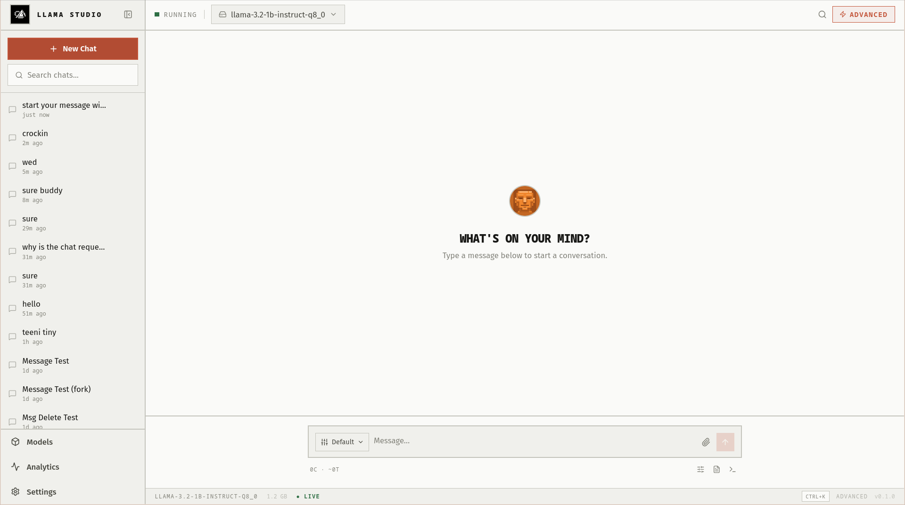

# LlamaStudio

<div align="center">
  

  <h1>LlamaStudio</h1>

  <p>
    <strong>Local-first AI chat for llama.cpp, packaged like a real desktop product.</strong>
  </p>

  <p>
    Chat, manage GGUF models, inspect runtime health, and ship desktop builds with updates.
  </p>

  <p>
    <a href="https://github.com/KM-Alee/llama-studio/releases">Releases</a>
    ·
    <a href="#quick-install">Quick Install</a>
    ·
    <a href="#features">Features</a>
    ·
    <a href="#development">Development</a>
  </p>

  
</div>

---

## Why It Impresses

LlamaStudio is designed to feel like a serious local AI desktop product, not a raw wrapper around `llama.cpp`.

- Clean brutalist UI with strong defaults
- Built-in desktop backend, so users do not need to run a separate service
- Dependency detection and onboarding for `llama-server`
- Windows and Linux desktop releases
- Update notifications for new GitHub releases
- Local chat, markdown rendering, templates, analytics, and model management

## Quick Install

### Linux

One-line install:

```bash
curl -fsSL https://raw.githubusercontent.com/KM-Alee/llama-studio/main/scripts/install-linux.sh | bash
```

### Windows

Download the latest installer from the [Releases page](https://github.com/KM-Alee/llama-studio/releases).

- `.exe` for the easiest installer flow
- `.msi` for enterprise or managed environments

## First Run

LlamaStudio already bundles its own backend.

On first launch:

1. Open `Settings`
2. Check `Runtime Dependencies`
3. Install `llama-server` if it is missing
4. Set your models directory
5. Import or scan GGUF models
6. Start chatting

## Features

- Streaming local chat with markdown, code blocks, tables, and math
- Template system with create, edit, and delete support
- Model browsing, import, download, and analytics
- Built-in settings for runtime dependencies and llama.cpp paths
- Advanced inference controls with safe defaults
- Desktop update prompt when a new release is available

## Releases

GitHub Actions builds release artifacts for:

- Windows: `NSIS`, `MSI`
- Linux: `AppImage`, `deb`, `rpm`

The release workflow is also prepared for:

- Tauri updater signatures
- Windows certificate import for code signing

## Code Signing

LlamaStudio includes release automation hooks for Windows signing and Tauri updater signatures.

To fully avoid SmartScreen and trust warnings in production, configure:

- `WINDOWS_CERTIFICATE`
- `WINDOWS_CERTIFICATE_PASSWORD`
- `TAURI_SIGNING_PRIVATE_KEY`
- `TAURI_SIGNING_PRIVATE_KEY_PASSWORD`
- `TAURI_UPDATER_PUBKEY`

For best Windows trust results, use an EV certificate or Azure Trusted Signing.

## Development

```bash
cd src-frontend
npm install
npm run lint
npm test
npm run build

cd ../src-backend
cargo test
```

## Repository Structure

```text
src-backend/          Rust backend
src-frontend/         React frontend + Tauri shell
docs/                 Product and architecture docs
scripts/              Installer helpers
.github/workflows/    CI and release automation
```

## Production Validation

These checks should pass before release:

```bash
cd src-frontend && npm run lint && npm test && npm run build
cd ../src-backend && cargo test
```

## License

MIT
