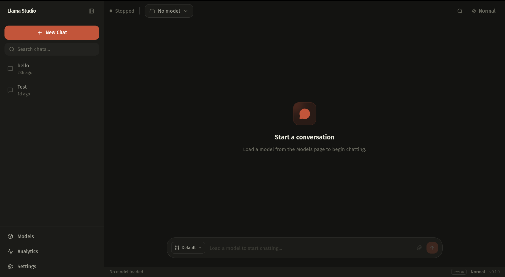

# AI Studio

<div align="center">
  
  
  <p align="center">
    <strong>A high-performance, local-first web UI for llama.cpp.</strong>
    <br />
    Built with Rust, React 19, and Tailwind CSS 4.
  </p>

  <p align="center">
    <a href="#features">Features</a> •
    <a href="#quick-start">Quick Start</a> •
    <a href="#tech-stack">Tech Stack</a> •
    <a href="#configuration">Configuration</a>
  </p>
</div>

---

AI Studio is a local-first desktop-style web UI for [llama.cpp](https://github.com/ggerganov/llama.cpp). It focuses on running GGUF models locally with a clean chat workflow, model management, and advanced llama.cpp controls without any external dependencies.

## 🚀 Features

- **🎭 Two User Profiles**: Switch between *Normal* for a clean experience and *Advanced* for deep control.
- **💬 Beautiful Chat UI**: Full Markdown rendering, code highlighting, and smooth SSE streaming.
- **📦 Model Management**: One-click scanning, importing, and loading of GGUF models.
- **🎨 Preset System**: Curated prompts for creative writing, coding, Q&A, and more.
- **⚡ Performance Dashboard**: Real-time tokens/sec, VRAM estimation, and context visualization.
- **🔒 Private & Local**: Zero telemetry. No accounts. Everything stays on your machine.
- **🛠️ Full Parameter Control**: Tweak temperature, top_p, top_k, grammar, and every llama.cpp flag.

## 📊 Status

- **Monorepo**: Rust Axum backend (`src-backend/`) & React + Vite frontend (`src-frontend/`).
- **Engine**: Manages `llama-server` as a subprocess, bound to `127.0.0.1` for security.
- **Stability**: CI validates backend (`cargo check`, `clippy`, `cargo test`) and frontend (type-check, lint, Vitest unit tests) on every push.

## 🛠️ Tech Stack

| Component | Technology |
|:---|:---|
| **Backend** | Rust + Axum |
| **Frontend** | React 19 + TypeScript + Vite |
| **Styling** | Tailwind CSS 4 |
| **State** | Zustand + TanStack Query |
| **Database** | SQLite (embedded) |
| **LLM Engine** | llama.cpp |

## 📦 Prerequisites

- **Rust** 1.70+
- **Node.js** 20+ (with `pnpm`)
- **llama.cpp**: Ensure `llama-server` is in your PATH or configured in settings.

## ⚡ Quick Start

```bash
# 1. Clone the repository
git clone <repo-url> ai-studio
cd ai-studio

# 2. Setup frontend
cd src-frontend && pnpm install && cd ..

# 3. Start development environment
make dev
```

> **Note**: On first run, go to **Settings** to configure your `models_directory` and `llama_cpp_path`.

## 📂 Project Structure

```
ai-studio/
├── src-backend/          # Rust Axum backend (logic, DB, process mgmt)
├── src-frontend/         # React SPA (components, stores, hooks)
├── docs/                 # Architecture, Specs, and Phase tracking
└── .github/              # Shared development guidelines
```

## ⚙️ Configuration

| Setting | Default | Description |
|:---|:---|:---|
| `llama_cpp_path` | `""` | Path to `llama-server` binary |
| `models_directory` | `~/models` | Folder to scan for .gguf files |
| `llama_server_port` | `8080` | Internal port for llama.cpp |
| `gpu_layers` | `-1` | Number of layers to offload to GPU |

## 🤝 Contributing

We welcome contributions! Please ensure:
1. Backend remains bound to `127.0.0.1`.
2. All API interactions are centralized in `src-frontend/src/lib/api.ts`.
3. You run `make check && make test` before opening a pull request.

Check [ARCHITECTURE.md](docs/ARCHITECTURE.md) for a deep dive into the system design.

## 📜 License

MIT

